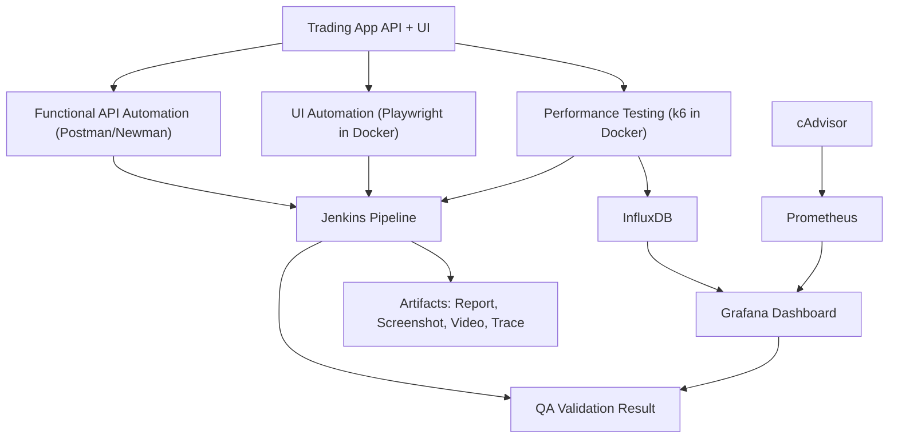

QA Lab: Belajar k6 + Jenkins + InfluxDB + Grafana untuk Trading App 24/7
=====================================================

Repo ini disiapkan sebagai lab kecil untuk belajar:

- frontend/UI automation dengan `Playwright`
- functional API automation dengan `Postman/Newman`
- automation/performance testing dengan `k6`
- CI/CD dasar dengan `Jenkins`
- penyimpanan hasil test ke `InfluxDB`
- visualisasi hasil test dan korelasi metrik di `Grafana`
- semua dijalankan lewat `Docker Compose`

Tujuan akhirnya: kamu bisa menjalankan regression API, load test manual, mengotomatisasi eksekusinya dari Jenkins, menyimpan hasil metrik ke InfluxDB, lalu membacanya di Grafana.

Real Case QA Automation
-----------------------

Sekarang lab ini dimodelkan seperti aplikasi trading atau stock app yang hidup terus 24/7. Fokusnya bukan cuma request sederhana, tapi pola akses yang lebih dekat ke production:

1. market data polling
2. watchlist refresh
3. portfolio refresh
4. order placement
5. order lookup
6. latency dan error-rate saat trafik naik

Flow itu dijalankan oleh `k6` untuk non-functional testing dan `Newman` untuk functional API regression. Hasil metrik performance dikirim ke InfluxDB. Jenkins dipakai untuk eksekusi otomatis seperti QA pipeline.

Flow Lab QA Automation
----------------------



Catatan penting:

- `1 juta user` tidak realistis dijalankan sebagai `1 juta VU` di laptop Docker lokal.
- yang realistis untuk lab lokal adalah mensimulasikan pola trafiknya dengan `arrival-rate`, lalu menaikkan beban bertahap.
- untuk benar-benar menuju skala ratusan ribu sampai jutaan user, biasanya dipakai distributed load test, banyak worker, infra terpisah, dan target environment yang juga memang siap.

Struktur Project
----------------

```text
qa-lab/
├── app/
│   ├── Dockerfile
│   └── server.py
├── docs/
│   └── qa-test-matrix.md
├── docker-compose.yml
├── grafana/
│   ├── dashboards/
│   └── provisioning/
├── Jenkinsfile
├── jenkins/
│   └── Dockerfile
├── k6/
│   └── script.js
├── postman/
│   └── trading-api.postman_collection.json
├── scripts/
│   ├── run_api_functional.sh
│   └── run_k6_profiles.sh
├── AGENTS.md
└── README.md
```

Komponen Lab
------------

- `App`: dummy API lokal untuk simulasi login, market ticker, order book, portfolio, dan order placement
- `Newman`: functional API regression suite
- `Playwright`: UI smoke automation untuk trading dashboard
- `Jenkins`: menjalankan pipeline automation
- `k6`: menjalankan load test
- `InfluxDB 1.8`: menyimpan metrik hasil `k6`
- `Grafana`: menampilkan dashboard hasil test dan export panel/dashboard
- `Prometheus`: scrape metrik runtime container Docker
- `cAdvisor`: expose metrik CPU dan memory container untuk Grafana

Endpoint Trading yang Disimulasikan
-----------------------------------

- `POST /api/login`
- `GET /api/market/tickers`
- `GET /api/market/depth?symbol=BBCA`
- `GET /api/watchlist`
- `GET /api/portfolio`
- `POST /api/orders`
- `GET /api/orders`
- `GET /api/orders/{id}`
- `POST /api/admin/market-state`
- `GET /`
- `GET /ui/styles.css`
- `GET /ui/app.js`

Kenapa pakai InfluxDB 1.8?

- setup lebih ringan untuk lab lokal
- `grafana/k6` bisa kirim hasil ke InfluxDB tanpa custom extension tambahan
- lebih enak untuk fokus belajar alur QA automation dulu

Kenapa pakai Grafana?

- lebih mudah membaca trend daripada output terminal `k6`
- cocok untuk membandingkan `smoke`, `load`, `stress`, `spike`, dan `market_open_chaos`
- bisa dipakai QA untuk korelasi latency, error rate, throughput, dan VU dalam satu dashboard
- bisa dipakai QA untuk korelasi latency, error rate, throughput, transaction rate, CPU, dan memory dalam satu dashboard
- panel dan dashboard bisa diexport ke JSON atau image dari UI Grafana

KPI Grafana yang Dipakai
------------------------

Dashboard utama sekarang mengikuti KPI ini:

- `RPS Overall`
- `TPS Overall`
- `Avg. Resp Time (API) ≤ 200 ms`
- `Overall Error Rate < 0.1%`
- `CPU Utilization < 50%`
- `Memory Utilization < 60%`

Sumber data:

- `InfluxDB`: `RPS Overall`, `TPS Overall`, `Avg. Resp Time (API)`, `Overall Error Rate`
- `Prometheus + cAdvisor`: `CPU Utilization`, `Memory Utilization`

Prasyarat
---------

- Docker
- Docker Compose
- Git

Cek versi:

```bash
docker --version
docker compose version
git --version
```

Quick Start
-----------

1. Clone repo:

```bash
git clone <repo-url>
cd qa-lab
```

2. Build dan jalankan service utama:

```bash
docker compose up -d --build
```

3. Cek container:

```bash
docker compose ps
```

4. Cek network lab:

```bash
docker network ls | grep qa-lab-net
```

5. Cek InfluxDB siap:

```bash
curl http://localhost:8086/ping
```

Kalau sehat, biasanya responnya `204 No Content`.

6. Cek Grafana siap:

```bash
curl http://localhost:3000/api/health
```

6a. Cek Prometheus siap:

```bash
curl http://localhost:9090/-/healthy
```

6b. Cek cAdvisor siap:

```bash
curl http://localhost:8081/healthz
```

7. Cek dummy app siap:

```bash
curl http://localhost:8000/health
curl http://localhost:8000/api/market/tickers
```

8. Ambil password awal Jenkins:

```bash
docker exec jenkins-lab cat /var/jenkins_home/secrets/initialAdminPassword
```

Kalau file itu tidak ada, biasanya volume Jenkins lama sudah pernah dipakai dan setup wizard sudah lewat.

9. Buka Jenkins:

```text
http://localhost:8080
```

10. Saat setup awal Jenkins:

- masukkan initial admin password
- pilih `Install suggested plugins`
- buat user admin

Command Lengkap Harian
----------------------

Start lab:

```bash
docker compose up -d --build
```

Stop lab:

```bash
docker compose down
```

Stop dan hapus volume:

```bash
docker compose down -v
```

Lihat log semua service:

```bash
docker compose logs -f
```

Lihat log Jenkins:

```bash
docker compose logs -f jenkins
```

Lihat log InfluxDB:

```bash
docker compose logs -f influxdb
```

Lihat log Grafana:

```bash
docker compose logs -f grafana
```

Lihat log Prometheus:

```bash
docker compose logs -f prometheus
```

Lihat log cAdvisor:

```bash
docker compose logs -f cadvisor
```

Lihat log dummy app:

```bash
docker compose logs -f app
```

Masuk shell Jenkins container:

```bash
docker exec -it jenkins-lab bash
```

Cek database `k6` di InfluxDB:

```bash
docker exec -it influxdb-lab influx -execute 'SHOW DATABASES'
```

Cek dashboard file yang diprovision ke Grafana:

```bash
ls grafana/dashboards
```

Lihat test matrix formal:

```bash
sed -n '1,220p' docs/qa-test-matrix.md
```

Menjalankan Functional API Automation
-------------------------------------

Functional regression suite sekarang ada di:

- [`postman/trading-api.postman_collection.json`](/Users/maul/github/qa-lab/postman/trading-api.postman_collection.json)
- [`scripts/run_api_functional.sh`](/Users/maul/github/qa-lab/scripts/run_api_functional.sh)

Coverage utama:

1. health check
2. login positive dan negative
3. unauthorized dan authorized portfolio
4. market tickers
5. create order dan order detail
6. invalid symbol
7. duplicate `clientOrderId`
8. market closed rejection

Jalankan manual:

```bash
cd /Users/maul/github/qa-lab
chmod +x scripts/run_api_functional.sh
./scripts/run_api_functional.sh
```

Report output:

- `reports/newman/functional-api.xml`
- `reports/newman/functional-api.json`

Menjalankan UI Automation
------------------------

UI dummy trading sekarang tersedia di:

- [http://localhost:8000](http://localhost:8000)

Playwright smoke runner:

- [`ui/playwright-smoke.mjs`](/Users/maul/github/qa-lab/ui/playwright-smoke.mjs)
- [`scripts/run_ui_smoke.sh`](/Users/maul/github/qa-lab/scripts/run_ui_smoke.sh)
- [`ui/playwright-negative.mjs`](/Users/maul/github/qa-lab/ui/playwright-negative.mjs)
- [`scripts/run_ui_negative.sh`](/Users/maul/github/qa-lab/scripts/run_ui_negative.sh)

Flow yang diuji:

1. buka dashboard trading UI
2. login
3. refresh market ticker
4. refresh portfolio
5. refresh watchlist
6. place order
7. verifikasi status order `FILLED`
8. ambil screenshot, video, dan trace

Flow negative yang diuji:

1. akses watchlist tanpa login
2. akses order history tanpa login
3. lookup order tanpa login
4. login valid lalu lookup order yang tidak ada
5. place order dengan quantity terlalu besar (insufficient buying power)

Jalankan manual:

```bash
cd /Users/maul/github/qa-lab
chmod +x scripts/run_ui_smoke.sh
./scripts/run_ui_smoke.sh
chmod +x scripts/run_ui_negative.sh
./scripts/run_ui_negative.sh
```

Artifact UI:

- `output/playwright/smoke/ui-home.png`
- `output/playwright/smoke/ui-order-success.png`
- `output/playwright/smoke/ui-smoke.webm`
- `output/playwright/smoke/trace.zip`
- `output/playwright/negative/ui-negative-home.png`
- `output/playwright/negative/ui-negative-result.png`
- `output/playwright/negative/ui-negative.webm`
- `output/playwright/negative/trace.zip`

Menjalankan k6 Secara Manual
----------------------------

Script `k6/script.js` sudah dibuat configurable lewat environment variable.

Variable yang dipakai:

- `TARGET_URL`: target URL yang mau ditest
- `TEST_PROFILE`: profile test. `smoke`, `load`, `stress`, `spike`, `market_open_chaos`, `soak`
- `TEST_DURATION`: durasi test
- `ITERATION_SLEEP`: jeda antar iterasi
- `LOGIN_USERNAME`: username login
- `LOGIN_PASSWORD`: password login
- `SYMBOL`: simbol saham untuk order/depth
- `ORDER_QUANTITY`: jumlah order
- `MARKET_RATE`: request rate untuk market data
- `PORTFOLIO_RATE`: request rate untuk portfolio polling
- `TRADE_RATE`: request rate untuk trading flow

Default target sekarang adalah aplikasi lokal:

```text
http://app:8000
```

Profile Test yang Disediakan
----------------------------

`smoke`

- validasi cepat endpoint dan flow order
- cocok untuk sanity check sebelum deploy

`load`

- steady-state traffic normal harian
- market polling, portfolio refresh, dan trading flow jalan bersamaan

`stress`

- traffic dinaikkan bertahap sampai bottleneck kelihatan
- dipakai untuk cari limit dan behavior saat overload

`spike`

- lonjakan tiba-tiba seperti market open, breaking news, atau panic buy/sell

`market_open_chaos`

- simulasi open market yang kacau: market data meledak, portfolio polling naik, order burst naik, negative traffic ikut naik
- cocok untuk chaos-style verification di jam kritikal

`soak`

- traffic sedang dalam durasi lama
- dipakai untuk cari memory leak, degradation, koneksi bocor, atau resource exhaustion

Contoh run default:

```bash
docker compose run --rm k6 run /scripts/script.js
```

Contoh smoke test:

```bash
docker compose run --rm \
  -e TARGET_URL=http://app:8000 \
  -e TEST_PROFILE=smoke \
  -e TEST_DURATION=30s \
  -e ITERATION_SLEEP=1 \
  -e LOGIN_USERNAME=qa_user \
  -e LOGIN_PASSWORD=qa_pass \
  -e SYMBOL=BBCA \
  -e ORDER_QUANTITY=1 \
  k6 run /scripts/script.js
```

Contoh load test realistis untuk app trading:

```bash
docker compose run --rm \
  -e TARGET_URL=http://app:8000 \
  -e TEST_PROFILE=load \
  -e TEST_DURATION=2m \
  -e ITERATION_SLEEP=1 \
  -e LOGIN_USERNAME=qa_user \
  -e LOGIN_PASSWORD=qa_pass \
  -e SYMBOL=BBCA \
  -e ORDER_QUANTITY=2 \
  -e MARKET_RATE=60 \
  -e PORTFOLIO_RATE=20 \
  -e TRADE_RATE=8 \
  k6 run --out influxdb=http://influxdb:8086/k6 /scripts/script.js
```

Contoh stress test:

```bash
docker compose run --rm \
  -e TARGET_URL=http://app:8000 \
  -e TEST_PROFILE=stress \
  -e LOGIN_USERNAME=performance_user \
  -e LOGIN_PASSWORD=secret123 \
  -e SYMBOL=BBRI \
  -e ORDER_QUANTITY=5 \
  -e MARKET_START_RATE=50 \
  -e STRESS_STAGE1=100 \
  -e STRESS_STAGE2=200 \
  -e STRESS_STAGE3=400 \
  -e TRADE_START_RATE=5 \
  -e TRADE_STAGE1=15 \
  -e TRADE_STAGE2=40 \
  -e TRADE_STAGE3=80 \
  k6 run --out influxdb=http://influxdb:8086/k6 /scripts/script.js
```

Contoh spike test:

```bash
docker compose run --rm \
  -e TARGET_URL=http://app:8000 \
  -e TEST_PROFILE=spike \
  -e LOGIN_USERNAME=trader_user \
  -e LOGIN_PASSWORD=trade123 \
  -e SYMBOL=GOTO \
  -e ORDER_QUANTITY=20 \
  k6 run --out influxdb=http://influxdb:8086/k6 /scripts/script.js
```

Contoh market open chaos:

```bash
docker compose run --rm \
  -e TARGET_URL=http://app:8000 \
  -e TEST_PROFILE=market_open_chaos \
  -e LOGIN_USERNAME=trader_user \
  -e LOGIN_PASSWORD=trade123 \
  -e SYMBOL=GOTO \
  -e ORDER_QUANTITY=20 \
  -e MARKET_START_RATE=40 \
  -e PORTFOLIO_START_RATE=10 \
  -e TRADE_START_RATE=5 \
  -e NEGATIVE_START_RATE=3 \
  k6 run --out influxdb=http://influxdb:8086/k6 /scripts/script.js
```

Contoh soak test:

```bash
docker compose run --rm \
  -e TARGET_URL=http://app:8000 \
  -e TEST_PROFILE=soak \
  -e TEST_DURATION=30m \
  -e LOGIN_USERNAME=performance_user \
  -e LOGIN_PASSWORD=secret123 \
  -e SYMBOL=TLKM \
  -e ORDER_QUANTITY=2 \
  -e MARKET_RATE=40 \
  -e PORTFOLIO_RATE=15 \
  -e TRADE_RATE=5 \
  k6 run --out influxdb=http://influxdb:8086/k6 /scripts/script.js
```

Kalau mau test endpoint app tanpa `k6`, kamu bisa coba:

```bash
curl http://localhost:8000/health
curl http://localhost:8000/api/market/tickers
curl "http://localhost:8000/api/market/depth?symbol=BBCA"
curl -X POST http://localhost:8000/api/login \
  -H "Content-Type: application/json" \
  -d '{"username":"qa_user","password":"qa_pass"}'
```

Cek apakah data sudah masuk:

```bash
docker exec -it influxdb-lab influx -database k6 -execute 'SHOW MEASUREMENTS'
```

Biasanya kamu akan melihat measurement seperti:

- `http_req_duration`
- `http_reqs`
- `vus`
- `iterations`
- `checks`

Grafana
-------

Service Grafana sekarang ikut jalan di Docker Compose dan sudah otomatis diprovision:

- URL: `http://localhost:3000`
- username: `admin`
- password: `admin123`
- datasource default: `InfluxDB-k6`
- datasource tambahan: `Prometheus-Docker`
- dashboard default: `QA Lab - k6 Trading Overview`
- dashboard tambahan: `QA Jenkins UI Build Trend`

Kalau service belum hidup:

```bash
docker compose up -d grafana
```

Verifikasi health:

```bash
curl http://localhost:3000/api/health
```

Apa yang Perlu Dilihat di Grafana untuk QA Automation
-----------------------------------------------------

Untuk QA automation performance, korelasi yang biasanya dilihat bukan cuma satu angka.

Yang utama:

1. `RPS Overall`
   lihat `http_reqs`
2. `TPS Overall`
   lihat `trading_transactions`
3. `Latency`
   lihat `http_req_duration` terutama `avg` dan `p95`
4. `Error Rate`
   lihat `http_req_failed`
5. `Resource Utilization`
   lihat `CPU Utilization` dan `Memory Utilization`
6. `Concurrency`
   lihat `vus`
7. `Scenario behavior`
   bandingkan run `smoke`, `load`, `stress`, `spike`, `market_open_chaos`, `soak`

Korelasi yang umum dipakai:

1. `RPS` naik tapi `TPS` tidak ikut naik biasanya berarti read traffic tinggi tapi transaksi bisnis tidak bertambah
2. `Latency naik` saat `RPS`, `TPS`, dan `vus` naik
3. `Error rate` mulai naik setelah throughput atau transaction rate tertentu
4. `CPU` dan `Memory` ikut naik saat `stress` atau `market_open_chaos`, ini dipakai untuk cari bottleneck container
5. `Soak` dipakai untuk lihat apakah latency, memory, atau error rate memburuk perlahan walau beban tetap
6. warning `flush operation took higher than expected push interval` biasanya menandakan laptop lokal, InfluxDB, atau target app sudah tidak sustain di rate itu

Kalau kamu lihat warning seperti:

- `request timeout`
- `flush operation took higher than the expected set push interval`

artinya ada bottleneck lokal. Untuk lab lokal, pendekatan yang masuk akal:

1. turunkan `MARKET_RATE`, `TRADE_RATE`, `PORTFOLIO_RATE`, atau stage target
2. naikkan `preAllocatedVUs` dan `maxVUs` hanya bila memang kurang
3. pisahkan test `load` dan `stress`, jangan langsung `chaos` berat
4. baca trend di Grafana, bukan cuma output terminal

Export dari Grafana
-------------------

Yang bisa diexport:

1. `Dashboard JSON`
   dari dashboard, klik `Share` lalu `Export`
2. `Panel image`
   dari panel, klik menu panel lalu `Share`
3. `CSV data`
   dari panel table/time series, klik `Inspect` lalu `Data`

Kalau mau backup dashboard provisioning dari repo, file default-nya ada di:

- [`grafana/dashboards/qa-k6-overview.json`](/Users/maul/github/qa-lab/grafana/dashboards/qa-k6-overview.json)
- [`grafana/provisioning/datasources/influxdb.yml`](/Users/maul/github/qa-lab/grafana/provisioning/datasources/influxdb.yml)
- [`grafana/provisioning/dashboards/dashboards.yml`](/Users/maul/github/qa-lab/grafana/provisioning/dashboards/dashboards.yml)

Test Case Matrix yang Lebih Realistis
-------------------------------------

Biasanya app trading 24/7 akan diuji dengan kategori seperti ini:

1. `Smoke Test`
   memastikan login, market data, portfolio, dan order API hidup
2. `Baseline Load Test`
   steady load normal harian untuk melihat latency p95, p99, throughput, error rate
3. `Stress Test`
   beban dinaikkan sampai error mulai muncul atau latency melonjak
4. `Spike Test`
   lonjakan mendadak saat open market atau breaking news
5. `Soak Test`
   jalan lama untuk cari degradation, leak, dan resource exhaustion
6. `Endurance + Recovery`
   beban lama lalu diturunkan, lihat apakah service pulih normal
7. `Concurrency on Critical Flow`
   order placement, order lookup, dan portfolio refresh serentak
8. `Read-heavy vs Write-heavy Mix`
   market data biasanya read-heavy, order placement write-heavy
9. `Negative and Abuse Mix`
   invalid login, unauthorized portfolio, invalid symbol, invalid side, invalid quantity, insufficient buying power

Dokumen matrix yang lebih formal ada di:

- [`docs/qa-test-matrix.md`](/Users/maul/github/qa-lab/docs/qa-test-matrix.md)

Kalau target business bilang "1 juta user", yang biasanya dilakukan:

1. hitung active concurrent user, bukan total registered user
2. ubah ke request pattern per detik
3. pecah jadi traffic mix
   misalnya 80% market polling, 15% portfolio/watchlist, 5% order
4. jalankan test bertahap
   misalnya 100 rps, 500 rps, 1k rps, 5k rps, dan seterusnya
5. kalau kapasitas laptop habis, pindah ke distributed workers

Cara Belajar Bertahap
---------------------

Urutan belajar yang disarankan:

1. Jalankan lab dengan `docker compose up -d --build`
2. Cek API lokal dengan `curl`
3. Jalankan `smoke`
4. Jalankan `load`
5. Jalankan `stress`
6. Jalankan `spike`
7. Jalankan `market_open_chaos`
8. Jalankan `soak`
9. Simpan hasil run penting di InfluxDB
10. Jalankan profile yang sama dari Jenkins
11. Bandingkan hasil antar profile

Setup Jenkins Job
-----------------

Repo ini sudah punya [`Jenkinsfile`](./Jenkinsfile) multi-stage.

Pipeline tersebut melakukan:

- validasi Docker bisa dipanggil dari Jenkins
- menjalankan `Functional API -> UI Automation (Smoke + Negative) -> Smoke -> Load -> Stress`
- mengirim hasil test ke InfluxDB
- menyimpan artifact report ke folder `reports/`
- menyimpan screenshot/video/trace UI ke folder `output/playwright/`

Cara pakai paling sederhana:

1. Push repo ini ke Git server kamu, atau pakai repo lokal yang bisa diakses Jenkins.
2. Buka Jenkins.
3. Klik `New Item`.
4. Pilih `Pipeline`.
5. Isi nama job, misalnya `qa-k6-lab`.
6. Masuk ke bagian `Pipeline`.
7. Pilih `Pipeline script from SCM`.
8. Pilih `Git`.
9. Isi URL repo.
10. Branch: `*/main` atau branch kamu.
11. Script Path: `Jenkinsfile`
12. Klik `Save`.
13. Klik `Build Now`.

Kalau kamu belum mau pakai SCM, kamu juga bisa paste isi `Jenkinsfile` langsung ke field pipeline script.

Parameter Jenkins yang Bisa Dipakai
-----------------------------------

Di Jenkins, parameter utamanya sekarang:

```text
TARGET_URL=http://app:8000
ITERATION_SLEEP=1
LOGIN_USERNAME=qa_user
LOGIN_PASSWORD=qa_pass
SYMBOL=BBCA
ORDER_QUANTITY=1
INFLUX_URL=http://influxdb:8086/k6
```

Artifact yang dihasilkan pipeline:

- `reports/newman/functional-api.xml`
- `reports/newman/functional-api.json`
- `output/playwright/ui-home.png`
- `output/playwright/ui-order-success.png`
- `reports/k6-smoke.log`
- `reports/k6-load.log`
- `reports/k6-stress.log`

Contoh kalau mau target internal API di Docker network yang sama:

```text
TARGET_URL=http://nama-service-api:3000/health
```

Contoh Pipeline Manual
----------------------

Kalau kamu mau buat job dari nol, ini contoh pipeline multi-stage yang bisa di-paste ke Jenkins:

```groovy
pipeline {
  agent any

  parameters {
    string(name: 'TARGET_URL', defaultValue: 'http://app:8000')
    string(name: 'ITERATION_SLEEP', defaultValue: '1')
    string(name: 'LOGIN_USERNAME', defaultValue: 'qa_user')
    password(name: 'LOGIN_PASSWORD', defaultValue: 'qa_pass')
    string(name: 'SYMBOL', defaultValue: 'BBCA')
    string(name: 'ORDER_QUANTITY', defaultValue: '1')
    string(name: 'INFLUX_URL', defaultValue: 'http://influxdb:8086/k6')
  }

  stages {
    stage('Smoke Check') {
      steps {
        sh 'docker version'
      }
    }

    stage('Smoke') {
      steps {
        sh '''
          docker run --rm \
            --network qa-lab-net \
            -v "$WORKSPACE/k6:/scripts:ro" \
            -e TARGET_URL="$TARGET_URL" \
            -e ITERATION_SLEEP="$ITERATION_SLEEP" \
            -e LOGIN_USERNAME="$LOGIN_USERNAME" \
            -e LOGIN_PASSWORD="$LOGIN_PASSWORD" \
            -e SYMBOL="$SYMBOL" \
            -e ORDER_QUANTITY="$ORDER_QUANTITY" \
            -e TEST_PROFILE="smoke" \
            -e TEST_DURATION="30s" \
            grafana/k6:latest run \
            --out influxdb="$INFLUX_URL" \
            /scripts/script.js
        '''
      }
    }

    stage('Load') {
      steps {
        sh '''
          docker run --rm \
            --network qa-lab-net \
            -v "$WORKSPACE/k6:/scripts:ro" \
            -e TARGET_URL="$TARGET_URL" \
            -e ITERATION_SLEEP="$ITERATION_SLEEP" \
            -e LOGIN_USERNAME="$LOGIN_USERNAME" \
            -e LOGIN_PASSWORD="$LOGIN_PASSWORD" \
            -e SYMBOL="$SYMBOL" \
            -e ORDER_QUANTITY="$ORDER_QUANTITY" \
            -e TEST_PROFILE="load" \
            -e TEST_DURATION="2m" \
            -e MARKET_RATE="60" \
            -e PORTFOLIO_RATE="20" \
            -e TRADE_RATE="8" \
            -e NEGATIVE_RATE="2" \
            grafana/k6:latest run \
            --out influxdb="$INFLUX_URL" \
            /scripts/script.js
        '''
      }
    }

    stage('Stress') {
      steps {
        sh '''
          docker run --rm \
            --network qa-lab-net \
            -v "$WORKSPACE/k6:/scripts:ro" \
            -e TARGET_URL="$TARGET_URL" \
            -e ITERATION_SLEEP="$ITERATION_SLEEP" \
            -e LOGIN_USERNAME="performance_user" \
            -e LOGIN_PASSWORD="secret123" \
            -e SYMBOL="$SYMBOL" \
            -e ORDER_QUANTITY="5" \
            -e TEST_PROFILE="stress" \
            -e MARKET_START_RATE="50" \
            -e STRESS_STAGE1="100" \
            -e STRESS_STAGE2="200" \
            -e STRESS_STAGE3="400" \
            -e TRADE_START_RATE="5" \
            -e TRADE_STAGE1="15" \
            -e TRADE_STAGE2="40" \
            -e TRADE_STAGE3="80" \
            -e NEGATIVE_START_RATE="2" \
            -e NEGATIVE_STAGE1="5" \
            -e NEGATIVE_STAGE2="10" \
            -e NEGATIVE_STAGE3="20" \
            grafana/k6:latest run \
            --out influxdb="$INFLUX_URL" \
            /scripts/script.js
        '''
      }
    }
  }
}
```

Latihan yang Disarankan
-----------------------

Latihan 1: smoke test trading flow

```bash
docker compose run --rm \
  -e TARGET_URL=http://app:8000 \
  -e TEST_PROFILE=smoke \
  -e TEST_DURATION=30s \
  k6 run /scripts/script.js
```

Latihan 2: load test market polling + trading

```bash
docker compose run --rm \
  -e TARGET_URL=http://app:8000 \
  -e TEST_PROFILE=load \
  -e TEST_DURATION=2m \
  -e MARKET_RATE=60 \
  -e PORTFOLIO_RATE=20 \
  -e TRADE_RATE=8 \
  k6 run --out influxdb=http://influxdb:8086/k6 /scripts/script.js
```

Latihan 3: stress test bertahap

```bash
docker compose run --rm \
  -e TARGET_URL=http://app:8000 \
  -e TEST_PROFILE=stress \
  -e LOGIN_USERNAME=performance_user \
  -e LOGIN_PASSWORD=secret123 \
  -e SYMBOL=BBRI \
  -e ORDER_QUANTITY=5 \
  k6 run /scripts/script.js
```

Latihan 4: spike test seperti jam buka market

```bash
docker compose run --rm \
  -e TARGET_URL=http://app:8000 \
  -e TEST_PROFILE=spike \
  -e LOGIN_USERNAME=trader_user \
  -e LOGIN_PASSWORD=trade123 \
  -e SYMBOL=GOTO \
  -e ORDER_QUANTITY=20 \
  k6 run /scripts/script.js
```

Latihan 5: market open chaos

```bash
docker compose run --rm \
  -e TARGET_URL=http://app:8000 \
  -e TEST_PROFILE=market_open_chaos \
  -e LOGIN_USERNAME=trader_user \
  -e LOGIN_PASSWORD=trade123 \
  -e SYMBOL=GOTO \
  -e ORDER_QUANTITY=20 \
  k6 run /scripts/script.js
```

Helper CLI
----------

Repo ini sekarang punya helper script:

[`scripts/run_k6_profiles.sh`](./scripts/run_k6_profiles.sh)

Contoh pakai:

```bash
chmod +x scripts/run_k6_profiles.sh
./scripts/run_k6_profiles.sh smoke
./scripts/run_k6_profiles.sh load
./scripts/run_k6_profiles.sh stress
./scripts/run_k6_profiles.sh chaos
./scripts/run_k6_profiles.sh all
```

Contoh Case QA yang Bisa Kamu Jelaskan Saat Interview
-----------------------------------------------------

Case:

- aplikasi trading punya flow kritikal: login, market data, portfolio refresh, place order, order lookup
- QA diminta memastikan flow itu tetap stabil saat market ramai
- hasil test harus bisa dijalankan manual dan otomatis dari Jenkins

Objective test:

- login tidak boleh banyak gagal
- market data p95 harus cepat
- order placement tidak boleh error
- portfolio refresh tetap responsif
- response time p95 harus tetap masuk batas
- pipeline harus fail kalau error rate terlalu tinggi

Apa yang sedang diuji di repo ini:

- validasi endpoint health
- validasi response login
- validasi ticker list tidak kosong
- validasi order book punya bid/ask
- validasi watchlist dan portfolio bisa dipoll
- validasi order placement menghasilkan `orderId`
- validasi order yang baru dibuat bisa diambil lagi
- validasi invalid login mengembalikan `401`
- validasi unauthorized portfolio mengembalikan `401`
- validasi invalid symbol mengembalikan `404`
- validasi invalid side mengembalikan `400`
- validasi invalid quantity mengembalikan `400`
- validasi insufficient buying power mengembalikan `422`

Validasi Hasil
--------------

Lihat measurement:

```bash
docker exec -it influxdb-lab influx -database k6 -execute 'SHOW MEASUREMENTS'
```

Lihat sebagian data `http_req_duration`:

```bash
docker exec -it influxdb-lab influx -database k6 -execute 'SELECT * FROM http_req_duration LIMIT 5'
```

Lihat sebagian data `http_reqs`:

```bash
docker exec -it influxdb-lab influx -database k6 -execute 'SELECT * FROM http_reqs LIMIT 5'
```

Troubleshooting
---------------

Kalau Jenkins tidak bisa menjalankan Docker:

```bash
docker exec -it jenkins-lab docker version
```

Kalau network tidak ketemu:

```bash
docker network inspect qa-lab-net
```

Kalau InfluxDB belum siap:

```bash
docker compose logs influxdb
```

Kalau Jenkins gagal baca repo:

- cek URL repository
- cek kredensial Git di Jenkins
- cek branch yang dipakai

Kalau hasil `k6` tidak masuk ke InfluxDB:

```bash
docker exec -it influxdb-lab influx -execute 'SHOW DATABASES'
docker exec -it influxdb-lab influx -database k6 -execute 'SHOW MEASUREMENTS'
```

Validasi Ringan Setelah Perubahan
---------------------------------

Validasi compose:

```bash
docker compose config
```

Validasi syntax `k6` script:

```bash
docker run --rm -v "$(pwd)/k6:/scripts:ro" grafana/k6:latest inspect /scripts/script.js
```

Validasi app lokal:

```bash
curl http://localhost:8000/health
curl http://localhost:8000/api/products
```

Checklist Belajar QA Automation
-------------------------------

- paham bedanya smoke test, load test, stress test
- paham bedanya spike test dan soak test
- paham kapan negative scenario harus ikut traffic mix
- bisa jelaskan critical user flow yang diuji
- bisa run `k6` manual untuk flow realistis
- bisa kirim hasil ke InfluxDB
- bisa baca measurement dasar di InfluxDB
- bisa membuat Jenkins pipeline
- bisa menjalankan test otomatis dari Jenkins
- bisa mengubah parameter test tanpa edit script utama
- paham kenapa `1 juta user` harus diterjemahkan ke traffic model, bukan langsung `1 juta VU`
- bisa menjalankan helper script untuk semua profile utama

Next Step yang Bagus
--------------------

- tambah target API lokal sendiri untuk dites
- tambahkan threshold `k6` untuk pass/fail build
- tambahkan stage Jenkins untuk report atau archive hasil
- kalau nanti butuh visual dashboard, baru tambahkan Grafana
