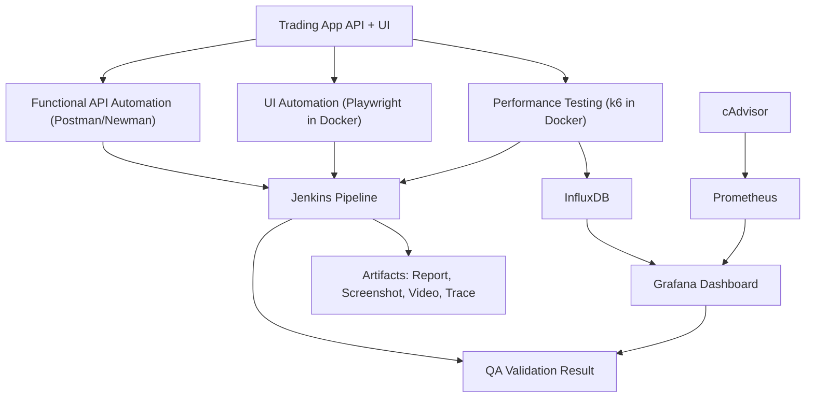

# QA Lab Home

Catatan ini adalah entry point untuk membuka repo ini dari Obsidian.

## Peta Note

- [[Lab Architecture]]
- [[Test Strategy]]
- [[Runbook]]
- [[../qa-test-matrix]]

## Scope

Lab ini dipakai untuk belajar QA automation end-to-end dengan komponen:

- API target lokal untuk simulasi trading app
- API automation dengan Newman
- UI automation dengan Playwright di Docker
- performance testing dengan k6 di Docker
- CI orchestration dengan Jenkins
- observability dengan InfluxDB, Prometheus, cAdvisor, dan Grafana

## URL Lokal

- App UI: <http://localhost:8000>
- Jenkins: <http://localhost:8080>
- Grafana: <http://localhost:3000>
- Prometheus: <http://localhost:9090>
- cAdvisor: <http://localhost:8081>
- InfluxDB: <http://localhost:8086>

## Alur Singkat

